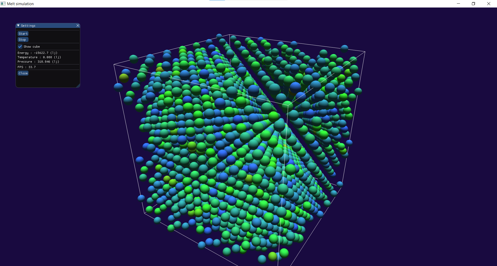

# Melt Simulation

## Description

A molecular dynamics simulation of a Lennard-Jones solid using an FCC lattice.
The simulation uses Velocity Verlet integration, periodic boundary conditions,
a version of the neighbor lists algorithm, and an optional thermostat.
Particles are rendered in real time using OpenGL.

## Screenshot

## Features

- Molecular Dynamics (MD)
- Lennard-Jones potential
- FCC lattice initialization
- Velocity Verlet integrator
- Periodic Boundary Conditions (PBC)
- Neighbor lists for faster force calculations
- Berendsen thermostat
- Real-time OpenGL visualization
- ImGui controls and statistics
- Output file with simulation variables

 ## Controls

- Right Mouse Button: Rotate camera
- Mouse Wheel: Zoom
- Start: Start simulation
- Stop: Stop simulation
- Show Cube: Render boundary box
- Escape: Exit application

 ## Output

Simulation data is written to files in the `output/` directory.
The `output/` directory is excluded from Git and is created automatically at runtime.
